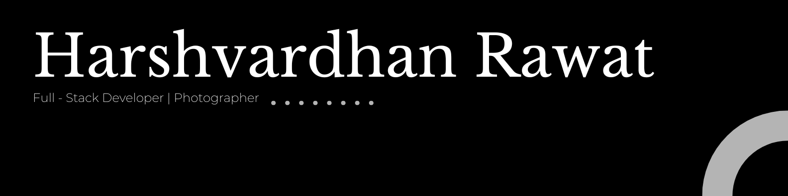

<!-- ======================= -->
<!--        BANNER          -->
<!-- Replace banner.png inside /assets folder -->
<!-- ======================= -->

<!-- ======================= -->
<!--      TOP BADGES        -->
<!-- ======================= -->

  
  &nbsp;
  
  &nbsp;
  

 

<!-- ======================= -->
<!--      ABOUT SECTION     -->
<!-- Replace left image if needed -->
<!-- ======================= -->

  <h2>Know About Me</h2>

  <h3>Hey there! I’m Harsh</h3>

I'm a Full Stack Developer and Content Creator obsessed with building cinematic digital experiences that feel smooth, modern, and alive. Most of my time goes into crafting scalable MERN applications, experimenting with clean UI/UX, and turning ideas into real-world products.

  

Beyond coding, I explore creativity through photography and storytelling. I enjoy building experiences that don't just work — they feel memorable.

  

<!-- ======================= -->
<!--    PROJECTS SECTION    -->
<!-- Replace project links -->
<!-- ======================= -->

<h3>Featured Projects</h3>

&nbsp; UNIMAP. 

&nbsp; CINEMYTH. 

&nbsp; Add your project description here.

 
 

<!-- ======================= -->
<!--     SOCIAL SECTION     -->
<!-- ======================= -->

  
   

   
  
  &nbsp;
  
  &nbsp;
  

 

<!-- ======================= -->
<!--         QUOTES         -->
<!-- ======================= -->

> Clean code. Cinematic experiences. Memorable products.

> I don't just build interfaces — I build experiences that feel smooth, intentional, and alive.

 
 

<!-- ======================= -->
<!--       FOOTER           -->
<!-- ======================= -->

### .rwt

<i>"Great products aren't just built. They're crafted."</i>

